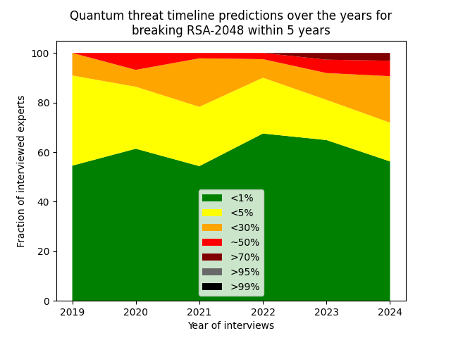
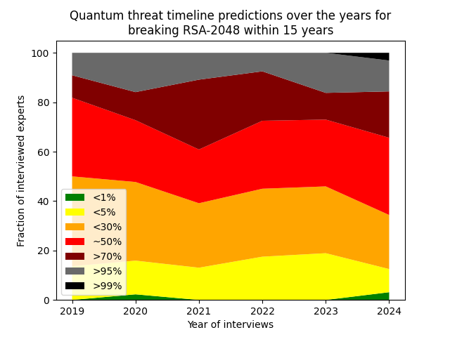
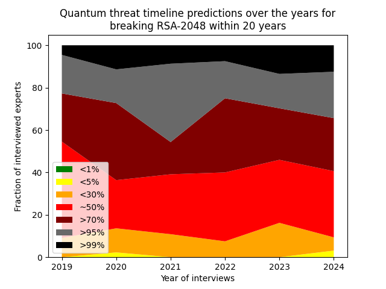
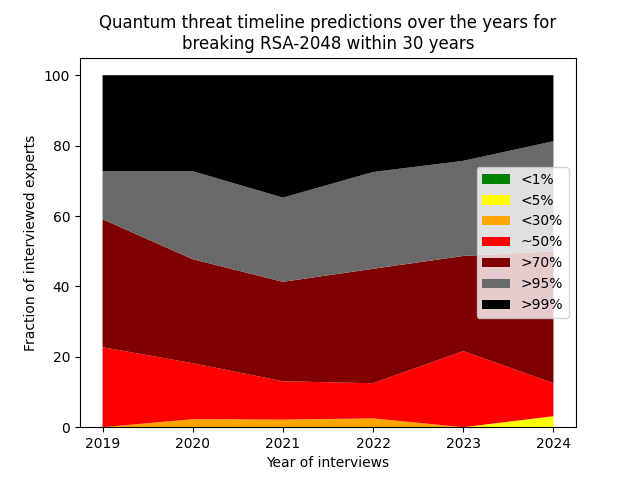
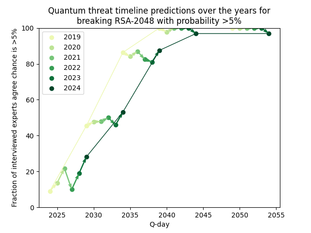
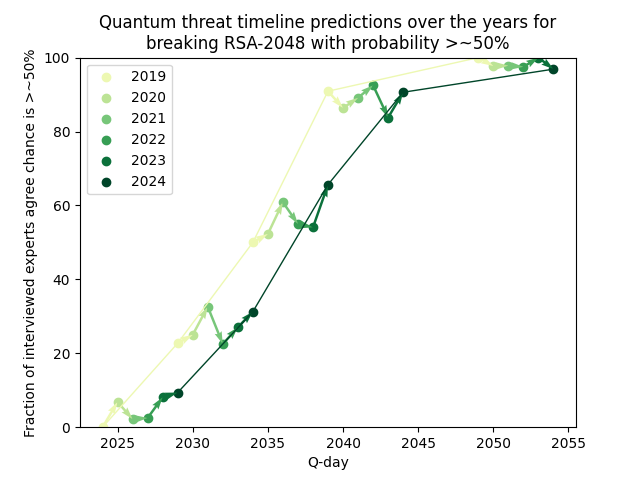
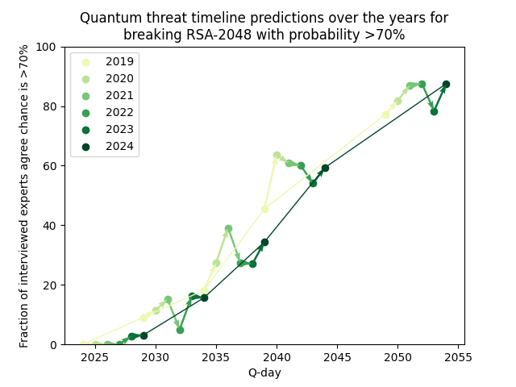
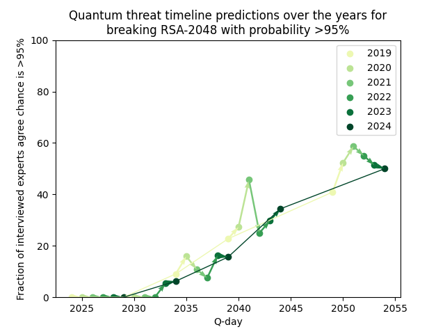
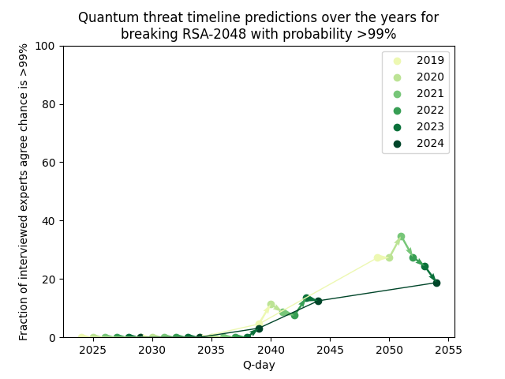

Global Risk Instutute Quantum Risk Timeline over the years
==========================================================

Each year since 2019 the Global Risk Institute performs a survey
amongst experts how likely it is RSA-2048 will be broken on 5, 10,
15, 20, and 30 year timelines.

This repo contains some graphs on how these predictions evolved over
the year.

By timeline
-----------

By certainty
------------

Source surveys
--------------
- [2019](https://globalriskinstitute.org/publication/quantum-threat-timeline/)
- [2020](https://globalriskinstitute.org/publication/quantum-threat-timeline-report-2020/)
- [2021](https://globalriskinstitute.org/publication/2021-quantum-threat-timeline-report-global-risk-institute-global-risk-institute/)
- [2022](https://globalriskinstitute.org/publication/2022-quantum-threat-timeline-report/)
- [2023](https://globalriskinstitute.org/publication/2023-quantum-threat-timeline-report/)
- [2024](https://globalriskinstitute.org/publication/2024-quantum-threat-timeline-report/)

